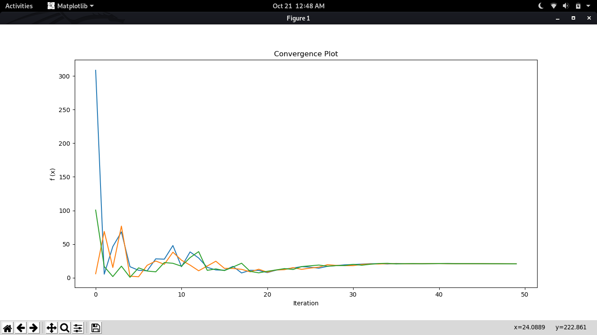
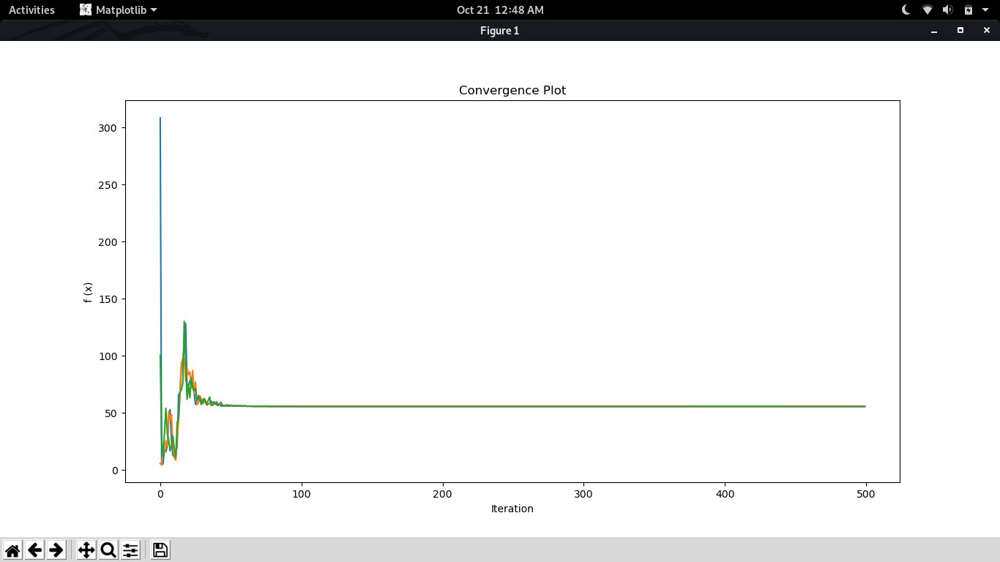
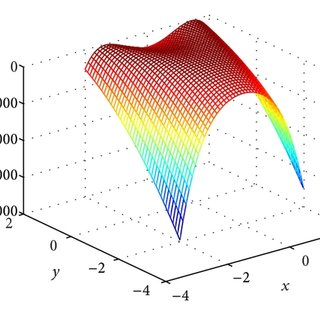
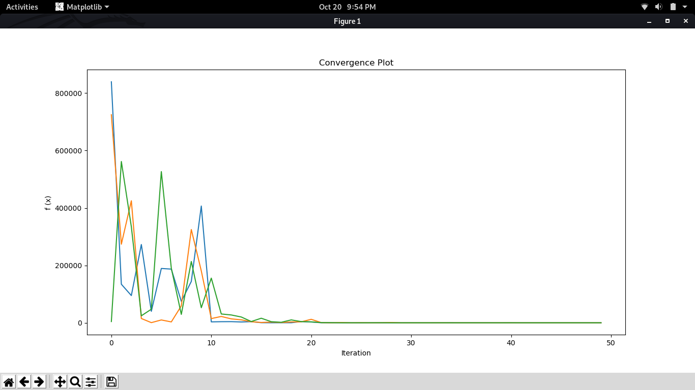
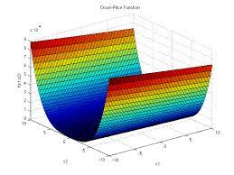
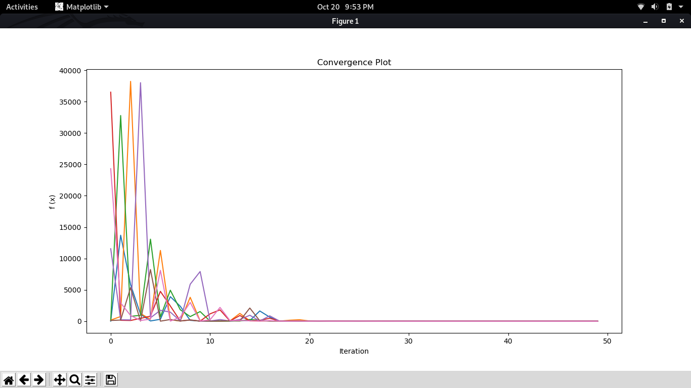
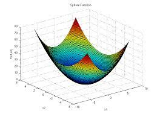
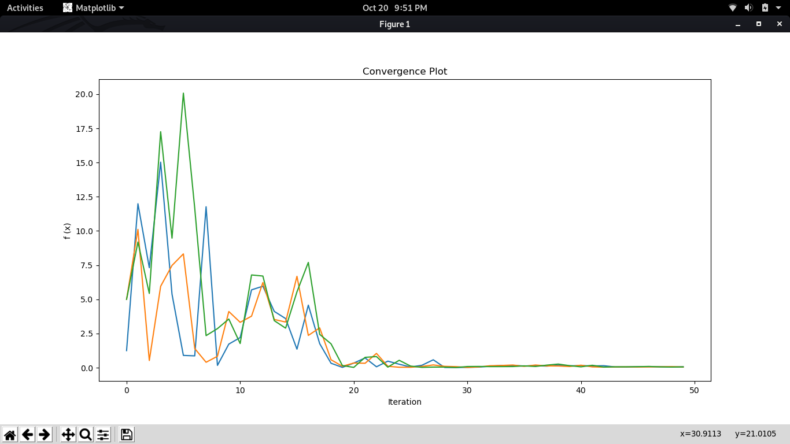

# Cohort-Intelligence-for-Mathematical-Functions

### About Cohort Intelligence :

Cohort Intelligence ( CI ) is an optimization technique. It attempts to model the behavior often observed in a self-organizing system in which candidates in a cohort interact and compete with one another in order to achieve shared goals. Each candidate tries to improve its own behavior by observing the behavior of every other candidate in that cohort. Each candidate in the cohort follows a certain behavior which may result in the improvement of its own behavior. When a candidate attempts to follow a given behavior characterized by certain qualities, it often adopts such qualities in a manner that may improve its own goal. In this way, candidates in the cohort learn from one another which, in time, helps improve the behavior of the entire group. The cohort’s behavior as a whole is said to have reached saturation (convergence) if, over a considerable number of learning attempts, the individual behavior of all candidates does not improve considerably making it difficult to distinguish between them. In other words, the difference between the individual behaviors of the candidates becomes insignificant.

[Read more about CI here.](https://sites.google.com/site/oatresearch/cohort-intelligence)

### This repository contains the following functions solved using Cohort Intelligence :

1. Colville Function
2. Dixon and Price Function
3. Sphere Function 

### 1. Branin Function :

The following [site](http://www.sfu.ca/~ssurjano/branin.html) provides data about Branin Function.

3D plot of Sphere Function :

The output of Branin Function using CI approach is provided below :

- Output with 50 Learning Attempts : 

- Output with 500 Learning Attempts : 

### 2. Colville Function :

The following [site](http://www.sfu.ca/~ssurjano/colville.html) provides data about Colville Function.

3D plot of Colville Function :

The Global Minimum of Colville Function is obtained at f(x*) = 0, at x* = (1,1,1,1).

The output of Colville Function using CI approach is provided below :

### 3. Dixon and Price Function :

The following [site](http://www.sfu.ca/~ssurjano/dixonpr.html) provides data about Dixon and Price Function.

3D plot of Dixon and Price Function :

The output of Colville Function using CI approach is provided below :

### 4. Sphere Function :

The following [site](https://www.sfu.ca/~ssurjano/spheref.html) provides data about Dixon and Price Function.

3D plot of Sphere Function :

The output of Colville Function using CI approach is provided below :

